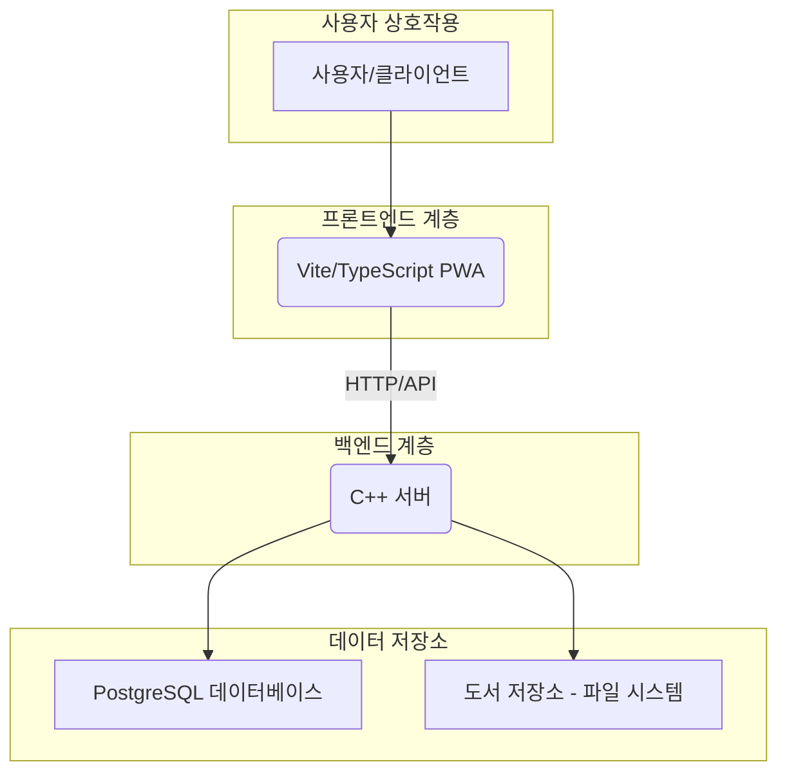

# myLibrary



고성능 C++ 백엔드와 Vite 기반의 모던 PWA(Progressive Web App) 프론트엔드를 갖춘 셀프 호스팅 디지털 라이브러리 서버입니다.

## 핵심 기능

-   **고성능 백엔드:** 효율적인 리소스 관리와 빠른 속도를 위해 C++로 제작되었습니다.
-   **PWA 프론트엔드:** 모든 기기에 설치 가능하며, 오프라인 기능을 지원하는 네이티브 앱과 같은 경험을 제공합니다.

-   **특정 포맷 지원:** EPUB, PDF, 코믹북 아카이브(CBZ, CBR)를 네이티브로 지원합니다.
-   **라이브러리 스캔:** 라이브러리 폴더의 미디어를 자동으로 탐색하고 인덱싱합니다.
-   **PostgreSQL 데이터베이스:** 데이터 관리를 위해 강력한 PostgreSQL 데이터베이스를 사용합니다.
-   **사용자 인증:** 핵심적인 사용자 및 세션 관리 기능이 구현되어 있습니다.

## 기술 스택

-   **백엔드:** C++17, PostgreSQL
-   **프론트엔드:** Vite, TypeScript
-   **주요 백엔드 라이브러리:** httplib (웹 서버), pqxx (PostgreSQL 클라이언트)

## 시스템 종속성

이 프로젝트를 빌드하고 실행하기 전에 특정 시스템 수준의 종속성을 설치해야 합니다.

### 백엔드 종속성

-   **C++17 호환 컴파일러:** (예: GCC, Clang)
-   **CMake:** 버전 3.14 이상.
-   **PostgreSQL 서버:** 데이터베이스 서버 자체.
-   **PostgreSQL 클라이언트 개발 라이브러리:** C++ 백엔드가 PostgreSQL에 연결하는 데 필요합니다. (예: Debian/Ubuntu의 `libpq-dev`, Arch Linux의 `postgresql-libs`).

### 프론트엔드 종속성

-   **Node.js:** LTS 버전 권장.
-   **npm:** Node Package Manager, 일반적으로 Node.js와 함께 설치됩니다.

## 시작하기

### 요구 사양

-   C++17 호환 컴파일러 (예: GCC, Clang)
-   CMake (3.14 이상)
-   PostgreSQL 서버
-   Node.js 와 npm

### 1. 데이터베이스 설정

이 프로젝트는 PostgreSQL을 사용합니다. 데이터베이스, 사용자, 스키마를 초기화하는 설정 스크립트가 제공됩니다.

**주의:** 이 스크립트는 PostgreSQL 서비스 및 데이터베이스 관리를 위해 `sudo` 권한을 요청할 수 있습니다.

```bash
# 'mylibrary_db' 데이터베이스와 'mylibrary_user'를 생성합니다.
sh ./init_database.sh
```
스크립트를 검토하여 기본 인증 정보가 보안 요구사항에 맞는지 확인하세요. C++ 애플리케이션은 `src/database.cpp`에 하드코딩된 연결 문자열을 사용하므로, 필요시 수정해야 할 수 있습니다.

### 2. 백엔드 빌드

```bash
mkdir -p build
cd build
cmake ..
make
```

### 3. 프론트엔드 빌드

프론트엔드는 Vite 기반의 PWA입니다.

```bash
cd frontend-vite
npm install
npm run build
```

### 4. 서버 실행

`build` 디렉토리의 서버 실행 파일이 프론트엔드와 API를 서비스합니다.

```bash
./build/myLibrary
```
애플리케이션은 `http://localhost:8080`에서 사용할 수 있습니다.

## 프로젝트 구조

-   `src/`, `include/`: 백엔드 C++ 소스 (비즈니스 로직, HTTP 서버) 및 헤더 파일.
-   `frontend-vite/`: 프론트엔드 PWA 소스 코드 (Vite + TypeScript).

-   `init_database.sh`, `setup_db.sql`: PostgreSQL 데이터베이스 초기화 스크립트.
-   `books/`: 라이브러리 미디어를 저장하는 기본 디렉토리.
-   `build/`: 빌드 결과물이 저장되는 디렉토리.

## API 엔드포인트

백엔드 서버에서 제공하는 REST API 엔드포인트 목록입니다:

### 인증

-   `POST /api/register`: 새로운 사용자 등록.
-   `POST /api/login`: 사용자 인증 및 세션 토큰 발급.
-   `POST /api/logout`: 현재 세션 무효화.

### 도서 관리

-   `POST /api/books/upload`: 새로운 도서 파일 업로드.
-   `GET /api/books`: 라이브러리에 있는 모든 도서 목록 조회.
-   `GET /api/books/{id}/download`: ID로 특정 도서 파일 다운로드.
-   `GET /api/books/{id}/file`: ID로 도서 파일을 인라인 보기 위해 접근.
-   `GET /api/books/{id}/thumbnail`: ID로 특정 도서의 썸네일 이미지 조회.

### 라이브러리 유지보수

-   `POST /api/library/cleanup-orphaned`: 데이터베이스에서 고아 도서 레코드 정리.
-   `POST /api/library/sync-scan`: 동기식 라이브러리 스캔 및 정리 시작.
-   `POST /api/library/scan`: 비동기식 라이브러리 스캔 시작.
-   `GET /api/library/scan-status`: 라이브러리 스캔의 현재 상태 조회.
-   `POST /api/library/scan-stop`: 진행 중인 라이브러리 스캔 중지 요청.

### 진행 상황 추적

-   `PUT /api/books/{id}/progress`: ID로 특정 도서의 읽기 진행 상황 업데이트.
-   `GET /api/books/{id}/progress`: ID로 특정 도서의 읽기 진행 상황 조회.

### 상태 확인

-   `GET /api/health`: 서버 상태 및 데이터베이스 연결 상태 확인.

## 로드맵

-   [ ] 파일(EPUB, PDF 등)에서 상세 메타데이터 추출 기능 강화.
-   [ ] 안정적인 썸네일 생성 및 관리 시스템 구축.
-   [ ] 라이브러리 전체 텍스트 검색 기능 구현.
-   [ ] 관리자 전용 대시보드 개발.
-   [ ] 역할 기반 접근 제어를 포함한 사용자 인증 시스템 개선.
-   [ ] 지속적인 UI/UX 개선.
