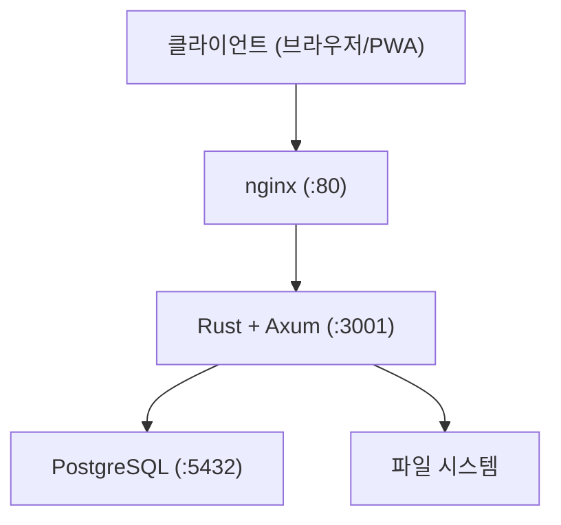

# myLibrary

> **베타.** 핵심 기능이 모두 작동합니다. Docker 원샷 배포 준비 완료. 아래 [빠른 시작](#빠른-시작)을 참고하세요.

자체 호스팅 전자책 서버. 오프라인 읽기, 멀티유저, 어노테이션 지원.

PDF, EPUB, CBZ 포맷 지원. 포맷별 전용 리더로 브라우저에서 렌더링. `docker compose up` 한 번으로 배포.

상세 내용(영문)은 [README.md](README.md)를 참조하세요.

## 기술 스택

| 레이어 | 기술 |
|---|---|
| 백엔드 | Rust, Axum 0.7, SQLx, PostgreSQL 16 |
| 프론트엔드 | SvelteKit (SPA/PWA), Tailwind CSS v4 |
| 인증 | JWT (Argon2 해시, 액세스 + 리프레시 토큰) |
| 검색 | PostgreSQL FTS (tantivy 전환 예정 — CJK/fuzzy) |
| 배포 | Docker Compose + nginx |

## 빠른 시작

### 사전 요구사항

- Docker 24+ 및 Docker Compose v2

### 단계

```bash
git clone https://github.com/oudeis01/myLibrary.git
cd myLibrary

# 1. 환경 파일 생성
cp .env.example .env
```

`.env`를 열어 세 가지 값을 설정합니다:

```bash
DB_PASSWORD=강력한_패스워드_설정       # PostgreSQL 비밀번호
JWT_SECRET=$(openssl rand -base64 32)  # 실행해서 생성
ADMIN_PASSWORD=관리자_비밀번호_설정     # 첫 로그인 비밀번호
```

```bash
# 2. 전체 스택 시작
docker compose up -d

# 3. 백엔드 기동 확인 (최초 실행 시 DB 마이그레이션 + admin 계정 자동 생성)
docker compose logs -f backend
# "listening on 0.0.0.0:3001" 메시지가 나오면 준비 완료
```

브라우저에서 **http://localhost** 접속 후 로그인:

- **사용자명**: `admin`
- **비밀번호**: `.env`에 설정한 `ADMIN_PASSWORD` 값

> admin 계정은 DB가 비어있는 최초 실행 시 자동으로 생성됩니다.

### 처음 사용 순서

1. **라이브러리 만들기** — Admin 메뉴 → Libraries → New Library. 이름과 컨테이너 내부 경로(예: `/books/personal`) 입력.

2. **책 업로드** — 라이브러리 페이지 → **+ 업로드** 버튼. PDF, EPUB, CBZ 파일을 드래그하거나 클릭해서 선택. 제목·저자·출판연도 입력 가능.

3. **책 읽기** — 책 카드를 클릭하면 포맷에 맞는 리더가 자동으로 열립니다.

4. **어노테이션** — PDF/EPUB 읽기 중 텍스트 선택 → 하이라이트/노트 생성. 우측 패널(✏️ 어노테이션 버튼)에서 전체 목록 확인.

5. **사용자 초대** — Admin 메뉴 → Users → 사용자 생성(`member` 역할). Libraries → Permissions에서 라이브러리 접근 권한 부여.

6. **PWA 설치** — Chrome/Safari에서 "홈 화면에 추가" 또는 "앱 설치". 설치 후 책 카드의 ☁ 버튼으로 오프라인 저장 가능.

### 데이터 관리

```bash
docker compose down        # 컨테이너 중지 (데이터 유지)
docker compose down -v     # 컨테이너 중지 + 모든 데이터 삭제
```

책 파일은 `books_data` Docker 볼륨, DB는 `pg_data` 볼륨에 저장됩니다.

### 베타 단계의 알려진 제한 사항

- **검색**: 풀텍스트 검색은 작동하지만 한국어·일본어·중국어(CJK) 검색 품질이 낮습니다. Tantivy 엔진 전환 예정.
- **HTTPS 미지원**: HTTP 80포트로만 작동. 외부 접속 시 Caddy/Traefik 등의 리버스 프록시로 TLS 추가 권장.
- **CBZ 어노테이션 없음**: CBZ는 북마크만 지원, 텍스트 하이라이트 없음.
- **시리즈 필드**: series, series_index UI 미구현. 베타 이후 추가 예정.

---

## 아키텍처


```mermaid
graph TB
    Client["클라이언트 (브라우저/PWA)"]
    Proxy["nginx (:80)"]
    Backend["Rust + Axum (:3001)"]
    DB["PostgreSQL (:5432)"]
    FS["파일 시스템"]

    Client --> Proxy
    Proxy --> Backend
    Backend --> DB
    Backend --> FS
```

## 기능

- **포맷 지원**: PDF (pdf.js), EPUB (epub.js), CBZ (zip.js)
- **포맷 감지**: 확장자가 아닌 매직 바이트 + 내부 구조 기반 판별
- **오프라인 읽기**: PWA + Service Worker 3단계 캐싱 + IndexedDB 저장. 오프라인 중 작성한 어노테이션·북마크는 큐에 저장 후 재연결 시 자동 동기화.
- **멀티유저**: admin / member / guest 역할, 라이브러리별 권한 제어
- **어노테이션**: 하이라이트, 노트, 색상 태그 (PDF, EPUB). JSON/Markdown 내보내기
- **북마크**: 페이지 북마크 (모든 포맷)
- **검색**: `/api/search?q=&type=book|annotation` — 책 및 어노테이션 통합 검색
- **업로드/편집**: 드래그앤드롭 업로드, 메타데이터 편집, 책 삭제 (admin)

## 개발 상태

| Phase | 내용 | 상태 |
|---|---|---|
| 0 | 프로젝트 스캐폴딩 | ✅ 완료 |
| 1 | 코어 MVP (파서, API, JWT, 리더) | ✅ 완료 |
| 2 | 오프라인 읽기 + PWA | ✅ 완료 |
| 3 | 어노테이션 + 북마크 | ✅ 완료 |
| 4 | 멀티유저 + 접근 제어 | ✅ 완료 |
| 5 | 업로드·메타데이터·태그·검색·Docker | ✅ 완료 |
| 6 | DELETE 책, /api/search, 오프라인 sync, 테스트 | ✅ 완료 |
| — | 다듬기: 모바일 UX, 썸네일 최적화, tantivy | 대기 중 |

자동화 테스트 23개: 포맷 감지 단위 테스트 11개 + HTTP 권한 통합 테스트 12개.

## 개발 환경 설정

```bash
# PostgreSQL만 컨테이너로 실행
docker compose -f docker-compose.dev.yml up -d

cp .env.example .env  # JWT_SECRET 등 설정

# 백엔드 실행 (admin 계정 자동 생성)
cd backend
ADMIN_USERNAME=admin ADMIN_PASSWORD=yourpassword cargo run

# 프론트엔드 실행 (별도 터미널)
cd frontend && bun install && bun run dev
```

**주의**: `.env`의 `BOOKS_PATH`, `THUMBS_PATH`는 절대경로로 설정. `cargo run` 실행 위치(`backend/`) 기준으로 상대경로가 해석됩니다.

## 라이선스

MIT
