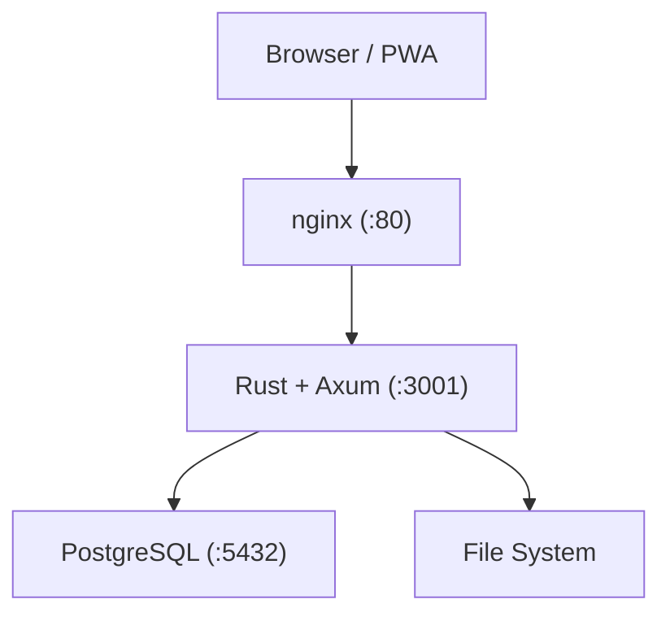

# myLibrary

> **Beta.** Core features are working end-to-end. Docker one-shot deploy is ready. See [Quick Start](#quick-start) below.

Self-hosted ebook server with offline reading, multi-user support, and annotations.

Supports PDF, EPUB, and CBZ formats. Rendered entirely in the browser via format-specific readers. Deployable with a single `docker compose up`.

## Tech Stack

| Layer | Technology |
|---|---|
| Backend | Rust, Axum 0.7, SQLx, PostgreSQL 16 |
| Frontend | SvelteKit (SPA/PWA), Tailwind CSS v4 |
| Auth | JWT (Argon2 password hashing, access + refresh tokens) |
| Search | PostgreSQL FTS (tantivy planned for CJK/fuzzy) |
| Reverse Proxy | nginx |
| Deployment | Docker Compose |

### Backend Dependencies

| Purpose | Crate |
|---|---|
| HTTP framework | `axum` 0.7 |
| Async runtime | `tokio` |
| Database | `sqlx` (PostgreSQL, compile-time query checking) |
| PDF parsing | `lopdf`, `pdf-extract` |
| EPUB parsing | `epub` |
| ZIP/CBZ handling | `zip` |
| Image processing | `image` (JPEG, PNG) |
| Fulltext search | PostgreSQL FTS (`to_tsvector` + GIN index) |
| Auth | `jsonwebtoken`, `argon2` |

### Frontend Dependencies

| Purpose | Package |
|---|---|
| PDF rendering | `pdfjs-dist` |
| EPUB rendering | `epubjs` |
| CBZ (ZIP inflate) | `@zip.js/zip.js` |
| Offline storage | `idb` (IndexedDB) |
| HTTP client | `ky` |
| PWA | `vite-plugin-pwa` |
| Icons | `lucide-svelte` |

## Quick Start

The fastest way to try myLibrary is with Docker Compose. No build tools needed on the host.

### Prerequisites

- Docker 24+ and Docker Compose v2

### Steps

```bash
git clone https://github.com/oudeis01/myLibrary.git
cd myLibrary

# 1. Create environment file
cp .env.example .env
```

Open `.env` and set three values:

```bash
DB_PASSWORD=choose_a_strong_password       # PostgreSQL password
JWT_SECRET=$(openssl rand -base64 32)      # Run this to generate
ADMIN_PASSWORD=choose_an_admin_password    # First login password
```

```bash
# 2. Start everything
docker compose up -d

# 3. Watch startup (backend applies DB migrations on first run)
docker compose logs -f backend
# Wait for: "listening on 0.0.0.0:3001"
```

Open **http://localhost** in your browser and log in with:

- **Username**: `admin`
- **Password**: the value you set for `ADMIN_PASSWORD`

> The admin account is created automatically on first startup if the database is empty.

### First steps after login

1. **Create a library** — Admin menu → Libraries → New Library. Enter a name and a path *inside the container* (e.g. `/books/personal`). Books uploaded via the UI are stored there.

2. **Upload a book** — Library page → **+ 업로드** button. Drop a PDF, EPUB, or CBZ file. Fill in optional metadata overrides (title, author, year).

3. **Read a book** — Click any book card. The in-browser reader opens automatically based on format.

4. **Annotate** — While reading a PDF or EPUB, select text to create a highlight or note. Open the side panel (✏️ 어노테이션 button) to review all annotations.

5. **Invite users** — Admin menu → Users → Create User. Assign role (`member`). Go to Libraries → Permissions to grant library access.

6. **Install as PWA** — In Chrome/Safari, use "Add to Home Screen" or "Install App". After installing, download books for offline reading via the ☁ button on each book card.

### Stopping and data persistence

```bash
docker compose down        # stop containers, keep data
docker compose down -v     # stop AND delete all data (books, DB, thumbnails)
```

Book files are stored in the `books_data` Docker volume. The database is in `pg_data`.

### Known limitations (beta)

- **Search**: Full-text search works but is English/simple-tokenizer only. CJK (Korean, Japanese, Chinese) search quality is limited. Tantivy engine planned.
- **No HTTPS**: Runs on HTTP port 80. Put behind a reverse proxy (Caddy, Traefik) with TLS for remote access.
- **No CBZ annotations**: CBZ supports bookmarks only, not text highlights.
- **series / series_index fields**: Not yet implemented in the UI.

---

## Architecture



## Features

### Format Support

| Format | Reading | Annotations | Bookmarks | Cover |
|---|---|---|---|---|
| PDF | Page rendering via pdf.js | Highlights, notes, color tags | Page bookmarks | Extracted from first page |
| EPUB | CFI-based via epub.js | Highlights, notes, color tags | Page bookmarks | Extracted from metadata |
| CBZ | Image sequence via zip.js | Not supported | Page bookmarks | First image |

Format detection uses magic bytes and internal structure inspection, not file extensions:
- `%PDF` magic: PDF
- `PK\x03\x04` magic + `mimetype` file containing `application/epub+zip`: EPUB
- `PK\x03\x04` magic + image-only contents: CBZ

### Offline Reading (PWA)

- Service Worker with 3-tier caching: app shell (cache-first), API (network-first), files (manual)
- Download books to IndexedDB for offline access
- Reading progress saved locally and synced on reconnect
- Installable as a PWA on mobile and desktop

### Multi-user and Access Control

| Role | Capabilities |
|---|---|
| admin | Create/delete libraries, manage users, scan, full access |
| member | Read libraries with granted permissions, read books, annotations |
| guest | Read-only access to permitted libraries |

Library-level permissions: `can_read`, `can_upload`, `can_edit`, `can_delete`, `can_manage`.

### Annotations and Bookmarks

- Highlights with color tags (PDF, EPUB)
- Text notes attached to highlights
- Page bookmarks (all formats)
- Export annotations as JSON or Markdown

### API Testing

Bruno collection included in `bruno-tests/`. Covers all endpoints with automated token management and variable chaining.

```bash
cd bruno-tests
bru run --env Local
```

## Project Structure

```
├── backend/                     # Rust backend
│   ├── src/
│   │   ├── main.rs              # AppState, server startup
│   │   ├── config.rs            # Environment config loader
│   │   ├── error.rs             # AppError enum
│   │   ├── models.rs            # Database models
│   │   ├── db.rs                # Connection pool + migrations
│   │   ├── api/
│   │   │   ├── mod.rs           # Router assembly
│   │   │   ├── auth.rs          # Login, refresh, logout
│   │   │   ├── libraries.rs     # Library CRUD + scan
│   │   │   ├── books.rs         # Book list, detail, download
│   │   │   ├── reader.rs        # EPUB and cover serving
│   │   │   ├── progress.rs      # Reading progress (UPSERT)
│   │   │   ├── annotations.rs   # Annotation CRUD + export
│   │   │   └── bookmarks.rs     # Bookmark CRUD
│   │   ├── auth/
│   │   │   ├── middleware.rs    # JWT extraction, AuthUser
│   │   │   └── mod.rs           # Token creation, hashing
│   │   └── services/
│   │       ├── scanner.rs       # Recursive directory scanner
│   │       ├── format_detector.rs  # Magic-byte format detection
│   │       └── parser/
│   │           ├── pdf.rs       # PDF metadata extraction
│   │           ├── epub.rs      # EPUB metadata extraction
│   │           └── cbz.rs       # CBZ metadata extraction
│   ├── Cargo.toml
│   └── Dockerfile
├── frontend/                    # SvelteKit SPA/PWA
│   ├── src/
│   │   ├── lib/
│   │   │   ├── api/             # HTTP client (ky)
│   │   │   ├── readers/         # PDF, EPUB, CBZ reader components
│   │   │   ├── components/      # BookCard, AnnotationPanel, BookmarkPanel
│   │   │   ├── stores/          # Svelte 5 runes stores
│   │   │   └── offline/         # IndexedDB, downloader, sync
│   │   ├── routes/              # SvelteKit file-based routing
│   │   └── sw.ts                # Service Worker
│   ├── package.json
│   └── Dockerfile
├── migrations/                  # PostgreSQL migration scripts (001-009)
├── nginx/
│   └── nginx.conf               # Reverse proxy configuration
├── bruno-tests/                 # Bruno API test collection
│   ├── environments/Local.bru   # Dev environment variables
│   ├── auth/                    # Auth endpoint tests
│   ├── libraries/               # Library endpoint tests
│   ├── books/                   # Book endpoint tests
│   ├── reader/                  # Reader endpoint tests
│   ├── progress/                # Progress endpoint tests
│   ├── annotations/             # Annotation endpoint tests
│   └── bookmarks/               # Bookmark endpoint tests
├── docker-compose.yml           # Production deployment
├── docker-compose.dev.yml       # Development (PostgreSQL only)
└── .env.example                 # Environment variable template
```

## API Reference

### Authentication

| Method | Endpoint | Auth | Description |
|---|---|---|---|
| POST | `/api/auth/login` | No | Login, returns access_token + refresh_token cookie |
| POST | `/api/auth/refresh` | Cookie | Refresh access_token via refresh_token cookie |
| POST | `/api/auth/logout` | Cookie | Revoke refresh_token, clear cookie |

### Libraries

| Method | Endpoint | Auth | Description |
|---|---|---|---|
| GET | `/api/libraries` | Bearer | List all libraries |
| POST | `/api/libraries` | Bearer (admin) | Create library |
| GET | `/api/libraries/:id` | Bearer | Get library detail |
| PUT | `/api/libraries/:id` | Bearer (admin) | Update library |
| DELETE | `/api/libraries/:id` | Bearer (admin) | Delete library |
| POST | `/api/libraries/:id/scan` | Bearer (admin) | Trigger background scan |

### Books

| Method | Endpoint | Auth | Description |
|---|---|---|---|
| GET | `/api/books` | Bearer | List books (query: library_id, format, tag, year, limit, offset) |
| GET | `/api/books/:id` | Bearer | Book detail with metadata |
| PATCH | `/api/books/:id` | Bearer (admin or can_upload) | Update metadata (title, authors, year, tags, description) |
| DELETE | `/api/books/:id` | Bearer (admin) | Delete book and its file |
| GET | `/api/books/:id/download` | Bearer | Download book file |
| POST | `/api/libraries/:id/upload` | Bearer (admin or can_upload) | Upload book file (multipart: file, title?, authors?, year?) |

### Search

| Method | Endpoint | Auth | Description |
|---|---|---|---|
| GET | `/api/search` | Bearer | Full-text search. Query: `q` (required), `type=book\|annotation` (default: book), `limit`, `offset` |

### Reader

| Method | Endpoint | Auth | Description |
|---|---|---|---|
| GET | `/api/reader/:id/epub` | Bearer | Serve EPUB file for reader |
| GET | `/api/reader/:id/cover` | Bearer | Serve cover image |

### Reading Progress

| Method | Endpoint | Auth | Description |
|---|---|---|---|
| GET | `/api/progress/:book_id` | Bearer | Get reading progress |
| PUT | `/api/progress/:book_id` | Bearer | Save/update progress (UPSERT) |

### Annotations

| Method | Endpoint | Auth | Description |
|---|---|---|---|
| GET | `/api/books/:id/annotations` | Bearer | List annotations |
| POST | `/api/books/:id/annotations` | Bearer | Create annotation |
| PUT | `/api/annotations/:id` | Bearer | Update annotation |
| DELETE | `/api/annotations/:id` | Bearer | Delete annotation |
| GET | `/api/books/:id/annotations/export?format=json` | Bearer | Export as JSON |
| GET | `/api/books/:id/annotations/export?format=md` | Bearer | Export as Markdown |

### Bookmarks

| Method | Endpoint | Auth | Description |
|---|---|---|---|
| GET | `/api/books/:id/bookmarks` | Bearer | List bookmarks |
| POST | `/api/books/:id/bookmarks` | Bearer | Create bookmark |
| DELETE | `/api/bookmarks/:id` | Bearer | Delete bookmark |

## Getting Started

### Prerequisites

- Docker and Docker Compose
- For local development: Rust (stable), Bun, PostgreSQL client

### Production Deployment

See [Quick Start](#quick-start) above for the recommended setup. Short version:

```bash
git clone https://github.com/oudeis01/myLibrary.git
cd myLibrary
cp .env.example .env
# Edit .env: DB_PASSWORD, JWT_SECRET, ADMIN_PASSWORD
docker compose up -d
```

Access at `http://localhost`. The admin account is created automatically on first startup. nginx proxies `/api/*` to the backend.

### Development Setup

```bash
# 1. Start PostgreSQL only
docker compose -f docker-compose.dev.yml up -d

# 2. Configure environment
cp .env.example .env
# Edit .env: set JWT_SECRET, and optionally ADMIN_USERNAME / ADMIN_PASSWORD

# 3. Start backend (migrations + admin user created automatically on first run)
cd backend
ADMIN_USERNAME=admin ADMIN_PASSWORD=yourpassword cargo run

# 4. Start frontend (separate terminal)
cd frontend
bun install
bun run dev
```

**Important**: Use absolute paths for `BOOKS_PATH` and `THUMBS_PATH` in `.env`. Relative paths resolve from the `backend/` directory where `cargo run` executes.

### Environment Variables

| Variable | Required | Description |
|---|---|---|
| `JWT_SECRET` | Yes | Min 32 characters. Generate with `openssl rand -base64 32` |
| `DB_PASSWORD` | Yes (production) | PostgreSQL password |
| `DATABASE_URL` | Yes | Full connection string |
| `BOOKS_PATH` | Yes | Absolute path to ebook files directory |
| `THUMBS_PATH` | Yes | Absolute path to thumbnail output directory |
| `SERVER_PORT` | No | Backend port (default: 3001) |
| `RUST_LOG` | No | Log level (default: info) |

## Database

PostgreSQL with 10 migration scripts:

| Migration | Tables / Changes |
|---|---|
| 001 | users |
| 002 | libraries |
| 003 | library_permissions |
| 004 | books |
| 005 | reading_progress |
| 006 | annotations |
| 007 | bookmarks |
| 008 | refresh_tokens |
| 009 | indexes |
| 010 | FTS helper function `book_search_vector()` + GIN indexes |

Migrations run automatically when the backend starts.

## Development Status

| Phase | Description | Status |
|---|---|---|
| 0 | Project scaffolding | ✅ Done |
| 1 | Core MVP (parsers, API, JWT auth, readers) | ✅ Done |
| 2 | Offline reading + PWA | ✅ Done |
| 3 | Annotations and bookmarks | ✅ Done |
| 4 | Multi-user + access control | ✅ Done |
| 5 | Upload, metadata edit, tags, search, Docker | ✅ Done |
| 6 | DELETE book, `/api/search`, offline annotation sync, tests | ✅ Done |
| — | Polish: mobile UX, thumbnail optimization, tantivy | Pending |

23 automated tests: 11 format-detection unit tests + 12 HTTP permission integration tests.

## License

MIT
