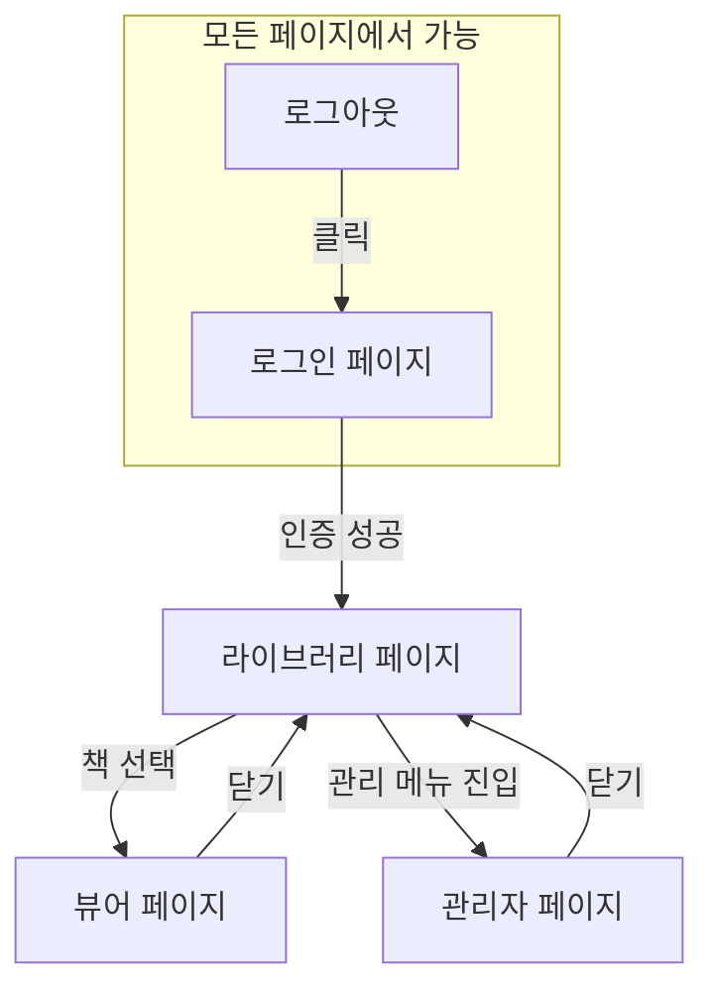
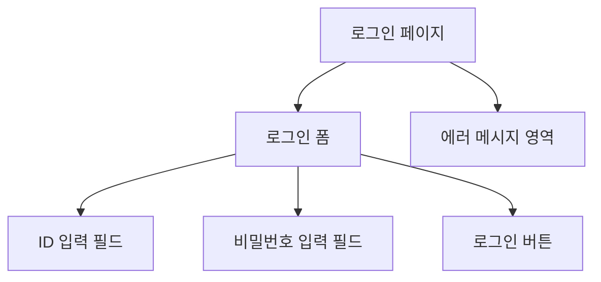
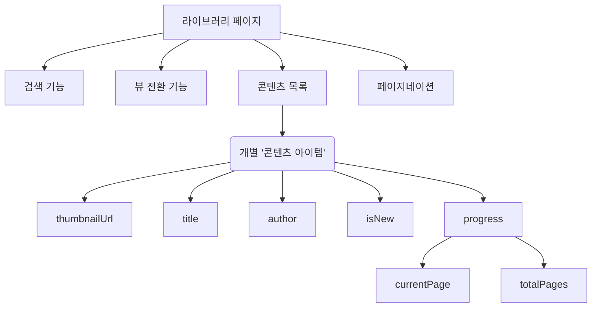
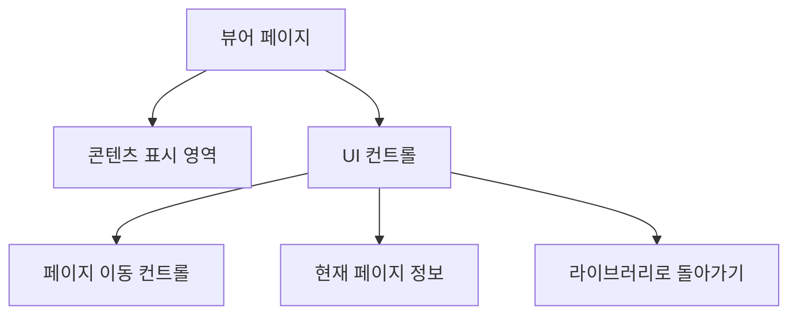
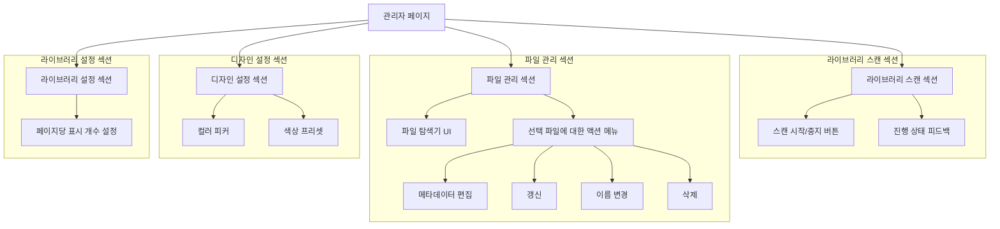

# MyLibrary 앱 디자인 가이드 (v3)

## 1. 문서의 목적

이 문서는 MyLibrary 애플리케이션의 기능적 요구사항과 데이터 구조를 정의하기 위해 작성되었습니다.

디자이너가 시각적, 경험적 디자인을 자유롭게 구상할 수 있도록, 이 문서는 구체적인 UI/UX 컴포넌트(버튼 모양, 색상, 레이아웃 등)를 의도적으로 배제하고 **사용자 흐름**과 **각 화면에서 사용할 수 있는 데이터**에 집중합니다.

## 2. 전체 사용자 흐름 (User Flow)

사용자는 로그인을 통해 라이브러리 핵심 기능에 접근하며, 라이브러리 내에서 관리 페이지로 진입할 수 있습니다.

## 3. 페이지별 상세 설명

### 3.1. 로그인 페이지 (Login Page)

- **목적:** 사용자가 시스템에 접근하기 위해 자신을 인증하는 페이지입니다.
- **주요 액션:** 사용자 정보 입력, 로그인 요청
- **필요 데이터/기능:**
    - ID 입력 필드
    - 비밀번호 입력 필드
    - 로그인 버튼
    - 로그인 실패 시 에러 메시지를 표시할 영역

- **요소 계층 구조:**

### 3.2. 라이브러리 페이지 (Library Page)

- **목적:** 사용자가 소장한 모든 디지털 콘텐츠를 탐색하고 선택하는 메인 페이지입니다.
- **주요 액션:** 콘텐츠 검색, 목록 스크롤, 특정 콘텐츠 선택하여 뷰어로 진입
- **필요 데이터/기능:**
    - **검색 기능:** 텍스트를 입력하여 콘텐츠 목록을 필터링합니다.
    - **뷰 전환 기능:** 카드 뷰 ↔ 리스트 뷰
    - **콘텐츠 목록:** 여러 개의 '콘텐츠 아이템'으로 구성됩니다.
    - **페이지네이션:** 많은 양의 콘텐츠를 여러 페이지로 나누어 보여줍니다.
    - **개별 '콘텐츠 아이템'이 표시할 수 있는 데이터:**
        - `thumbnailUrl` (String): 표지 이미지 주소
        - `title` (String): 제목
        - `author` (String): 저자
        - `isNew` (Boolean): 최근 추가된 콘텐츠인지 여부 (e.g., 'New' 뱃지 표시용)
        - `progress`: 읽기 진행 상태
            - `currentPage` (Number)
            - `totalPages` (Number)

- **요소 계층 구조:**

### 3.3. 뷰어 페이지 (Viewer Page)

- **목적:** 선택된 콘텐츠의 내용을 실제로 보여주는 페이지입니다.
- **주요 액션:** 페이지 넘기기, 라이브러리로 돌아가기
- **필요 데이터/기능:**
    - **콘텐츠 표시 영역:** 책의 본문이 렌더링되는 공간입니다.
    - **페이지 이동 컨트롤:** 다음/이전 페이지로 이동하는 기능.
    - **현재 페이지 정보 표시:** (e.g., "5 / 120")
    - **라이브러리로 돌아가기 기능**

- **요소 계층 구조:**

### 3.4. 관리자 페이지 (Admin Page)

- **목적:** 라이브러리 시스템을 설정하고 콘텐츠를 관리하는 통합 페이지입니다. 모든 관리 기능은 이 페이지 내에서 다른 페이지로 이동 없이 처리됩니다.
- **주요 기능 및 필요 데이터:**
    (각 기능은 페이지 내 별도 섹션으로 구성)

- **요소 계층 구조:**
