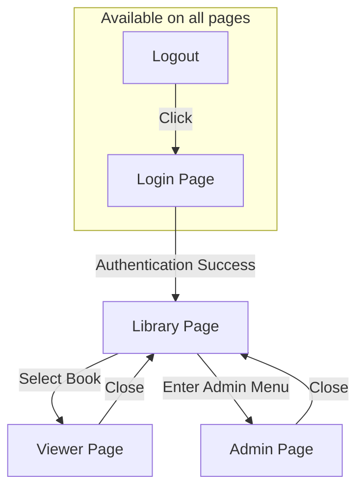
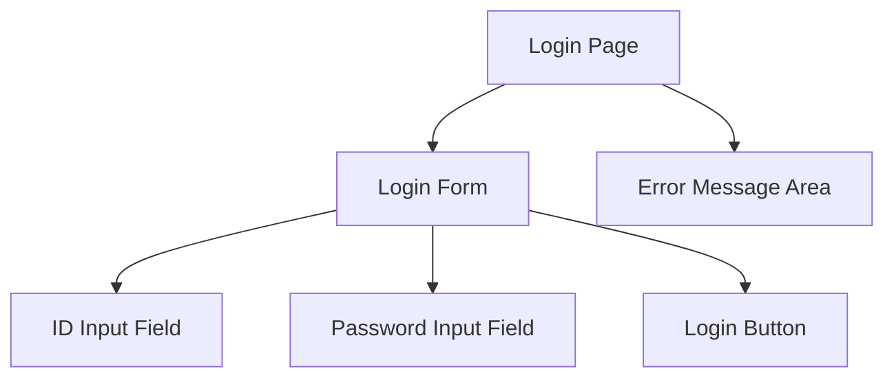
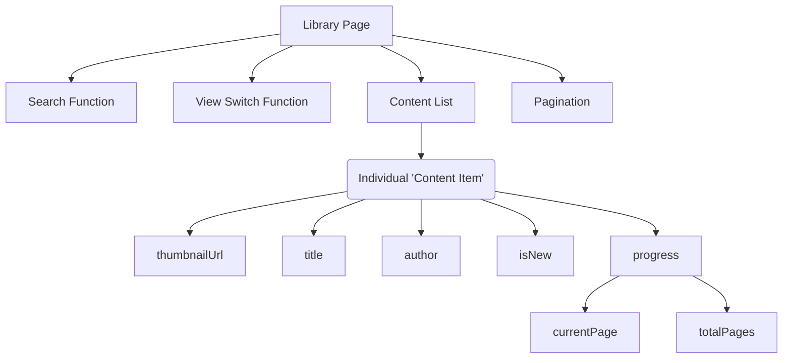
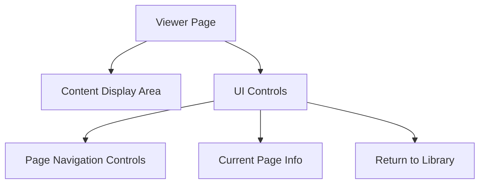
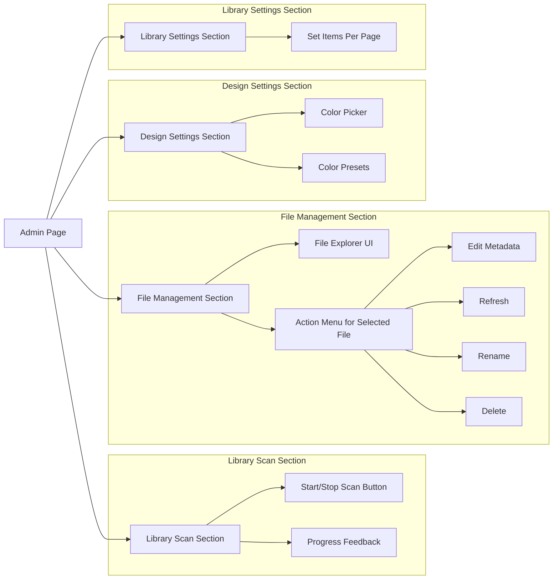

# MyLibrary App Design Guide (v3)

## 1. Purpose of this Document

This document defines the functional requirements and data structure for the MyLibrary application.

To allow the designer creative freedom in visual and experiential design, this document intentionally avoids specifying UI/UX components (like button shapes, colors, layouts, etc.) and instead focuses on **user flow** and the **data available on each screen**.

## 2. Overall User Flow

The user accesses the core library functions by logging in, and can enter the admin page from within the library.

## 3. Page-by-Page Details

### 3.1. Login Page

- **Purpose:** This is the page where users authenticate themselves to access the system.
- **Key Actions:** Entering user information, requesting login.
- **Required Data/Functions:**
    - ID input field
    - Password input field
    - Login button
    - An area to display error messages on login failure.

- **Element Hierarchy:**

### 3.2. Library Page

- **Purpose:** The main page where users browse and select all their digital content.
- **Key Actions:** Searching content, scrolling through the list, selecting specific content to enter the viewer.
- **Required Data/Functions:**
    - **Search Function:** Filters the content list by entering text.
    - **View Switch Function:** Card View ↔ List View
    - **Content List:** Composed of multiple 'Content Items'.
    - **Pagination:** Divides a large amount of content into multiple pages.
    - **Data that an individual 'Content Item' can display:**
        - `thumbnailUrl` (String): Cover image address
        - `title` (String): Title
        - `author` (String): Author
        - `isNew` (Boolean): Whether the content was recently added (e.g., for displaying a 'New' badge)
        - `progress`: Reading progress status
            - `currentPage` (Number)
            - `totalPages` (Number)

- **Element Hierarchy:**

### 3.3. Viewer Page

- **Purpose:** The page that actually displays the content of the selected item.
- **Key Actions:** Turning pages, returning to the library.
- **Required Data/Functions:**
    - **Content Display Area:** The space where the book's body is rendered.
    - **Page Navigation Controls:** Functions to move to the next/previous page.
    - **Current Page Info Display:** (e.g., "5 / 120")
    - **Return to Library Function**

- **Element Hierarchy:**

### 3.4. Admin Page

- **Purpose:** An integrated page for configuring the library system and managing content. All admin functions are handled within this page without navigating to other pages.
- **Key Functions and Required Data:**
    (Each function is organized as a separate section within the page)

- **Element Hierarchy:**
