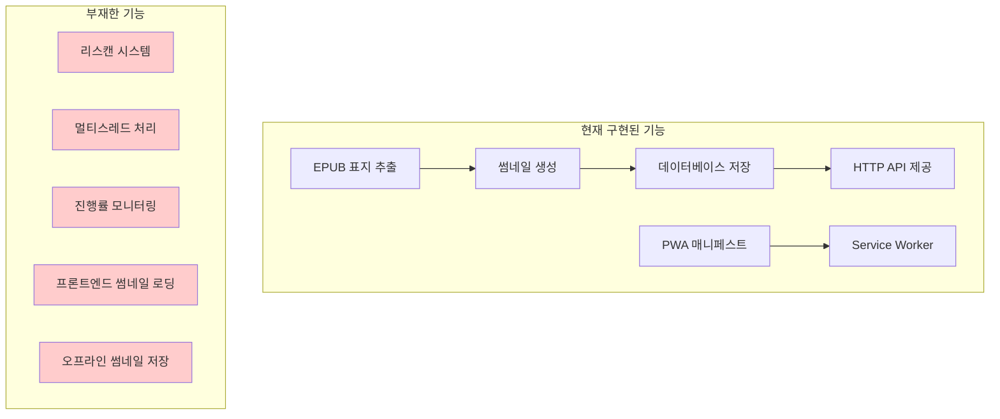
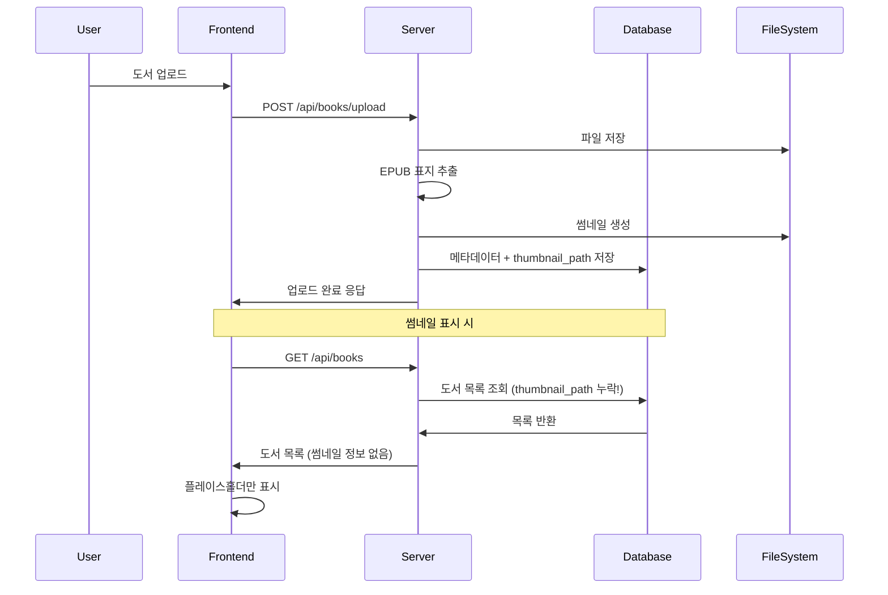
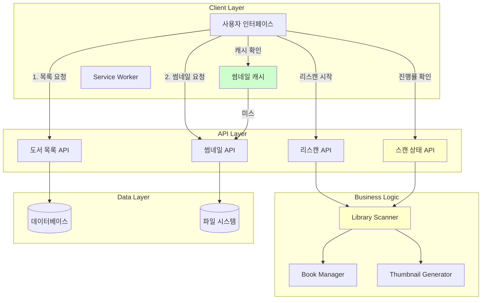
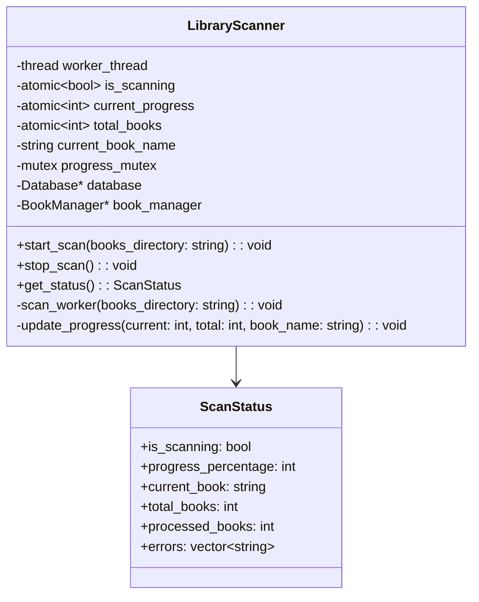
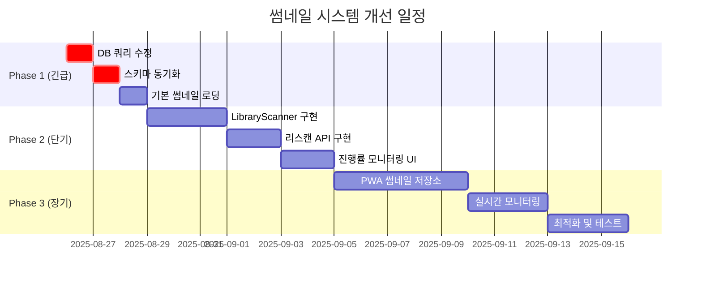
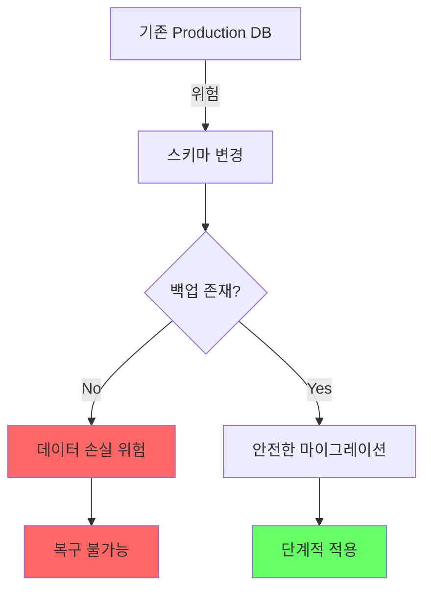
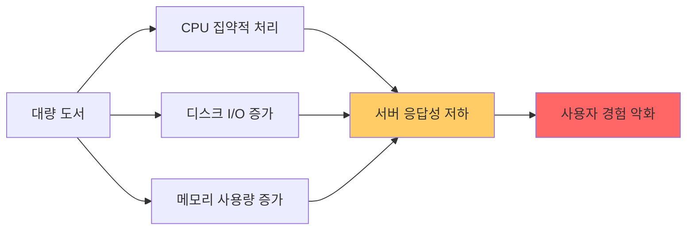
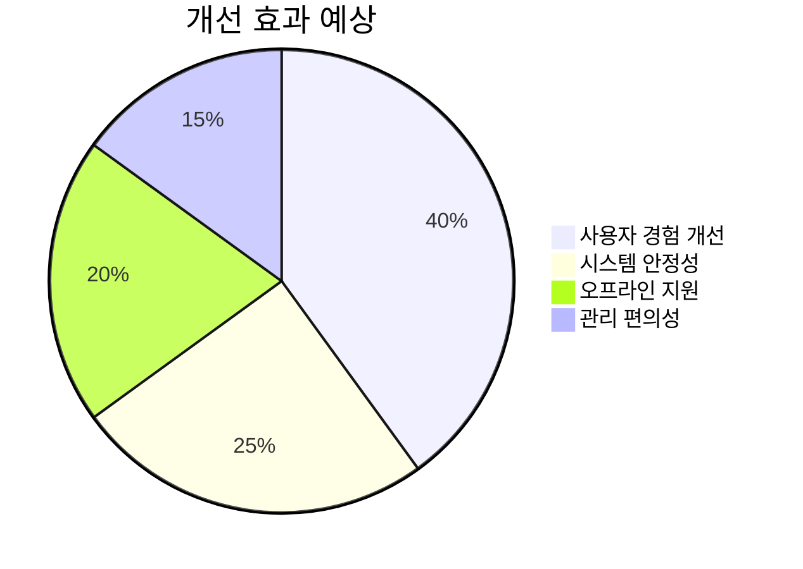

# 📸 썸네일 처리 시스템 개선 계획서

**작성일시**: 2025년 8월 26일 14:35  
**작성자**: MyLibrary Development Team  
**문서 버전**: 1.0  

---

## 📋 목차

1. [현황 분석](#1-현황-분석)
2. [시스템 아키텍처 분석](#2-시스템-아키텍처-분석)
3. [개선 계획](#3-개선-계획)
4. [구현 단계](#4-구현-단계)
5. [위험 요소](#5-위험-요소)
6. [결론](#6-결론)

---

## 1. 현황 분석

### 1.1 요구사항 정의

#### 클라이언트 측 요구사항
1. **점진적 썸네일 로딩**: 도서 목록 우선 표시 → 썸네일 개별 로딩
2. **로딩 상태 표시**: 아스키 점자 스피너 → 썸네일 또는 플레이스홀더
3. **PWA 오프라인 저장**: 썸네일 로컬 캐싱으로 오프라인 지원
4. **리스캔 기능**: 전체 도서 재처리 버튼 및 진행률 모니터링

#### 서버 측 요구사항
1. **배치 리스캔**: 별도 스레드에서 도서 메타데이터 및 썸네일 재처리
2. **진행률 보고**: 실시간 처리 상황 보고
3. **중단 없는 처리**: 사용자가 모니터링 페이지를 벗어나도 계속 진행

### 1.2 현재 구현 상태



### 1.3 중요한 발견사항

#### 🚨 긴급 수정 필요
1. **데이터베이스 쿼리 오류**: `get_user_books_with_progress`에서 `thumbnail_path` 누락
2. **스키마 불일치**: `create_tables_if_not_exists()`와 실제 사용되는 필드 불일치

#### ✅ 활용 가능한 기존 기능
1. **썸네일 생성 로직**: `book_manager.cpp`에 완전 구현됨
2. **API 엔드포인트**: `/api/books/{id}/thumbnail` 작동함
3. **PWA 기반**: 매니페스트와 Service Worker 기본 설정 완료

---

## 2. 시스템 아키텍처 분석

### 2.1 현재 썸네일 처리 플로우



### 2.2 목표 아키텍처



---

## 3. 개선 계획

### 3.1 즉시 적용 가능한 수정사항

#### A. 데이터베이스 쿼리 수정 (우선순위: 🔥 긴급)

**문제**: `get_user_books_with_progress` 쿼리에서 `thumbnail_path` 누락

**현재 코드** (`database.cpp:110-114`):
```sql
SELECT b.id, b.title, b.author, b.file_type, b.file_size, b.uploaded_at,
       p.progress_details, p.last_accessed_at
FROM books b 
LEFT JOIN user_book_progress p ON b.id = p.book_id AND p.user_id = $1
```

**수정 코드**:
```sql
SELECT b.id, b.title, b.author, b.file_type, b.file_size, b.uploaded_at, b.thumbnail_path,
       p.progress_details, p.last_accessed_at
FROM books b 
LEFT JOIN user_book_progress p ON b.id = p.book_id AND p.user_id = $1
```

#### B. 데이터베이스 스키마 동기화

**문제**: `create_tables_if_not_exists()`에서 확장 필드들 누락

**현재 books 테이블** (`database.cpp:38-47`):
```sql
CREATE TABLE IF NOT EXISTS books (
    id SERIAL PRIMARY KEY,
    title VARCHAR(255) NOT NULL,
    author VARCHAR(255),
    file_path VARCHAR(500) UNIQUE NOT NULL,
    file_type VARCHAR(10) NOT NULL,
    file_size BIGINT NOT NULL DEFAULT 0,
    uploaded_at TIMESTAMP DEFAULT CURRENT_TIMESTAMP
)
```

**수정 필요**: `upgrade_db.sql`의 필드들을 기본 스키마에 포함

### 3.2 프론트엔드 썸네일 로딩 구현

#### A. 기본 썸네일 로딩 로직

**파일**: `frontend-vite/src/main.ts`  
**수정 위치**: `loadBooks()` 함수 내 HTML 템플릿

**현재 코드** (라인 186-188):
```html
<div class="book-cover" id="cover-${book.id}">
  <div class="cover-placeholder">📖</div>
</div>
```

**개선 코드**:
```html
<div class="book-cover" id="cover-${book.id}">
  <div class="thumbnail-loading">⠋⠙⠹⠸⠼⠴⠦⠧⠇⠏</div>
  
  <div class="cover-placeholder" style="display:none">📖</div>
</div>
```

#### B. 썸네일 로딩 함수 추가

```typescript
/**
 * @brief 도서 썸네일을 비동기로 로드
 * @param bookId 도서 ID
 * @param coverElement 썸네일을 표시할 DOM 요소
 */
async function loadThumbnailForBook(bookId: string, coverElement: HTMLElement): Promise<void> {
    const token = localStorage.getItem('sessionToken');
    const loadingEl = coverElement.querySelector('.thumbnail-loading') as HTMLElement;
    const imgEl = coverElement.querySelector('.thumbnail-image') as HTMLImageElement;
    const placeholderEl = coverElement.querySelector('.cover-placeholder') as HTMLElement;
    
    try {
        // 로컬 캐시 확인 (향후 PWA 기능)
        const cachedThumbnail = await getCachedThumbnail(bookId);
        if (cachedThumbnail) {
            showThumbnail(imgEl, loadingEl, placeholderEl, cachedThumbnail);
            return;
        }
        
        // 서버에서 썸네일 요청
        const response = await fetch(`http://localhost:8080/api/books/${bookId}/thumbnail`, {
            headers: { 'X-Session-Token': token }
        });
        
        if (response.ok) {
            const blob = await response.blob();
            const objectURL = URL.createObjectURL(blob);
            
            // PWA 캐시에 저장 (향후 기능)
            await cacheThumbnail(bookId, blob);
            
            showThumbnail(imgEl, loadingEl, placeholderEl, objectURL);
        } else {
            showPlaceholder(loadingEl, placeholderEl);
        }
    } catch (error) {
        console.warn(`썸네일 로드 실패 (책 ID: ${bookId}):`, error);
        showPlaceholder(loadingEl, placeholderEl);
    }
}
```

### 3.3 서버측 리스캔 시스템 설계

#### A. LibraryScanner 클래스 설계



**파일**: `include/library_scanner.h` (신규 작성)

```cpp
/**
 * @file library_scanner.h
 * @brief Library scanning and metadata extraction system
 */

#ifndef LIBRARY_SCANNER_H
#define LIBRARY_SCANNER_H

#include <thread>
#include <atomic>
#include <mutex>
#include <string>
#include <vector>
#include <memory>

class Database;
class BookManager;

/**
 * @struct ScanStatus
 * @brief Current scanning operation status
 */
struct ScanStatus {
    bool is_scanning = false;
    int progress_percentage = 0;
    std::string current_book = "";
    int total_books = 0;
    int processed_books = 0;
    std::vector<std::string> errors;
    std::chrono::system_clock::time_point start_time;
};

/**
 * @class LibraryScanner
 * @brief Handles background library scanning and metadata extraction
 */
class LibraryScanner {
private:
    std::thread worker_thread;
    std::atomic<bool> is_scanning{false};
    std::atomic<bool> should_stop{false};
    std::atomic<int> current_progress{0};
    std::atomic<int> total_books{0};
    std::atomic<int> processed_books{0};
    std::string current_book_name;
    std::vector<std::string> error_log;
    mutable std::mutex progress_mutex;
    std::chrono::system_clock::time_point scan_start_time;
    
    Database* database;
    BookManager* book_manager;
    
    /**
     * @brief Worker thread function for scanning
     * @param books_directory Directory containing book files
     */
    void scan_worker(const std::string& books_directory);
    
    /**
     * @brief Update scanning progress (thread-safe)
     * @param current Current book index
     * @param total Total number of books
     * @param book_name Current book being processed
     */
    void update_progress(int current, int total, const std::string& book_name);

public:
    /**
     * @brief Constructor
     * @param db Database instance
     * @param bm BookManager instance
     */
    LibraryScanner(Database* db, BookManager* bm);
    
    /**
     * @brief Destructor - ensures proper cleanup
     */
    ~LibraryScanner();
    
    /**
     * @brief Start scanning operation in background thread
     * @param books_directory Directory containing book files
     * @return true if scan started successfully, false if already scanning
     */
    bool start_scan(const std::string& books_directory);
    
    /**
     * @brief Request scan operation to stop
     */
    void stop_scan();
    
    /**
     * @brief Get current scanning status (thread-safe)
     * @return ScanStatus Current status
     */
    ScanStatus get_status() const;
    
    /**
     * @brief Check if currently scanning
     * @return true if scan operation is active
     */
    bool is_scan_active() const { return is_scanning.load(); }
};

#endif // LIBRARY_SCANNER_H
```

#### B. HTTP API 엔드포인트 추가

**파일**: `src/http_server.cpp`에 추가할 엔드포인트들

```cpp
// 리스캔 시작
server.Post("/api/library/rescan", [this](const httplib::Request& req, httplib::Response& res) {
    handle_start_rescan(req, res);
});

// 스캔 상태 조회
server.Get("/api/library/scan-status", [this](const httplib::Request& req, httplib::Response& res) {
    handle_get_scan_status(req, res);
});

// 스캔 중지
server.Post("/api/library/scan-stop", [this](const httplib::Request& req, httplib::Response& res) {
    handle_stop_scan(req, res);
});
```

### 3.4 PWA 오프라인 썸네일 저장소

#### A. IndexedDB 썸네일 캐시

**파일**: `frontend-vite/src/lib/thumbnail-storage.ts` (신규 작성)

```typescript
/**
 * @class ThumbnailStorage
 * @brief PWA용 오프라인 썸네일 저장소
 */
class ThumbnailStorage {
    private dbName = 'MyLibraryThumbnails';
    private version = 1;
    private storeName = 'thumbnails';
    private db: IDBDatabase | null = null;
    
    /**
     * @brief 데이터베이스 초기화
     */
    async init(): Promise<void> {
        return new Promise((resolve, reject) => {
            const request = indexedDB.open(this.dbName, this.version);
            
            request.onerror = () => reject(request.error);
            request.onsuccess = () => {
                this.db = request.result;
                resolve();
            };
            
            request.onupgradeneeded = (event) => {
                const db = (event.target as IDBOpenDBRequest).result;
                const store = db.createObjectStore(this.storeName, { keyPath: 'bookId' });
                store.createIndex('timestamp', 'timestamp', { unique: false });
            };
        });
    }
    
    /**
     * @brief 썸네일 저장
     * @param bookId 도서 ID
     * @param blob 썸네일 이미지 데이터
     */
    async storeThumbnail(bookId: string, blob: Blob): Promise<void> {
        // 구현 상세...
    }
    
    /**
     * @brief 썸네일 조회
     * @param bookId 도서 ID
     * @return 캐시된 썸네일 또는 null
     */
    async getThumbnail(bookId: string): Promise<Blob | null> {
        // 구현 상세...
    }
    
    /**
     * @brief 만료된 캐시 정리
     */
    async clearExpired(): Promise<void> {
        // 구현 상세...
    }
}
```

---

## 4. 구현 단계

### 4.1 Phase 1: 긴급 수정 (1-2일)



#### 즉시 수정 항목
1. ✅ **`get_user_books_with_progress` 쿼리 수정**
   - `thumbnail_path` 필드 추가
   - 코드 위치: `database.cpp:110-114`

2. ✅ **`get_user_books_with_progress` 함수에서 응답 추가**
   - JSON 응답에 `thumbnail_path` 포함
   - 코드 위치: `database.cpp:232-248`

3. ✅ **프론트엔드 썸네일 로딩 기본 구현**
   - HTML 템플릿 수정
   - 스피너 → 썸네일 → 플레이스홀더 플로우

### 4.2 Phase 2: 리스캔 시스템 (1주일)

#### 서버측 구현
1. **LibraryScanner 클래스 작성** (~350줄)
   - 멀티스레드 안전 진행률 추적
   - 도서 폴더 스캔 및 메타데이터 추출
   - 에러 처리 및 로깅

2. **HTTP API 엔드포인트 추가** (~150줄)
   - `POST /api/library/rescan`
   - `GET /api/library/scan-status`
   - `POST /api/library/scan-stop`

#### 클라이언트측 구현
3. **리스캔 모니터링 UI** (~200줄)
   - 진행률 표시 컴포넌트
   - 실시간 상태 업데이트
   - 로그 콘솔 UI

### 4.3 Phase 3: PWA 고급 기능 (2-3주일)

1. **오프라인 썸네일 저장소** (~300줄)
2. **Service Worker 업데이트** (~100줄)
3. **실시간 모니터링** (WebSocket/SSE) (~200줄)

---

## 5. 위험 요소

### 5.1 치명적 위험 요소

#### 🔴 데이터베이스 마이그레이션 위험


**대응 방안**:
1. **강제 백업**: 스키마 변경 전 필수 백업
2. **단계적 적용**: 새 필드 추가 → 데이터 마이그레이션 → 구버전 호환성 유지
3. **롤백 계획**: 문제 발생시 즉시 롤백 가능한 스크립트 준비

#### 🔴 멀티스레드 안전성
**위험 상황**:
- 리스캔 중 동시 도서 업로드
- 썸네일 생성 중 파일 시스템 충돌
- 데이터베이스 동시 접근

**대응 방안**:
```cpp
// 파일 시스템 락
class FileLockManager {
    std::unordered_map<std::string, std::mutex> file_mutexes;
    std::mutex map_mutex;
public:
    std::unique_lock<std::mutex> lock_file(const std::string& path);
};

// 데이터베이스 트랜잭션 분리
class ScanTransaction {
    // 읽기 전용 트랜잭션으로 스캔 수행
    // 메타데이터 업데이트는 별도 짧은 트랜잭션
};
```

### 5.2 성능 영향

#### 리스캔 시 서버 과부하


**대응 방안**:
1. **스레드 풀 제한**: 동시 처리 도서 수 제한
2. **우선순위 큐**: 사용자 요청 우선 처리
3. **자원 모니터링**: CPU/메모리 사용량 기준 스캔 속도 조절

---

## 6. 결론

### 6.1 즉시 적용 권장사항

1. **🔥 긴급**: `get_user_books_with_progress` 쿼리 수정
   - 현재 썸네일 기능이 전혀 작동하지 않는 근본 원인
   - 5분 내 수정 가능

2. **📈 단기**: 프론트엔드 기본 썸네일 로딩 구현
   - 사용자 경험 즉시 개선
   - 1일 내 구현 가능

### 6.2 장기 로드맵

#### 2주차까지 목표
- ✅ 완전한 썸네일 표시 시스템
- ✅ 기본 리스캔 기능
- ✅ 진행률 모니터링

#### 1개월차까지 목표  
- ✅ PWA 오프라인 썸네일 지원
- ✅ 실시간 모니터링 시스템
- ✅ 고급 캐시 정책

### 6.3 성공 지표



1. **사용자 경험**: 썸네일 로딩 시간 50% 단축
2. **시스템 안정성**: 리스캔 중에도 정상 서비스 유지
3. **오프라인 지원**: 네트워크 없이도 썸네일 표시
4. **관리 편의성**: 원클릭 전체 라이브러리 리스캔

---

## 🔧 첫 번째 수정 사항

**파일**: `src/database.cpp`  
**라인**: 110-114  
**수정 내용**: `thumbnail_path` 필드 추가

**Before**:
```sql
"SELECT b.id, b.title, b.author, b.file_type, b.file_size, b.uploaded_at, "
```

**After**:  
```sql
"SELECT b.id, b.title, b.author, b.file_type, b.file_size, b.uploaded_at, b.thumbnail_path, "
```

**예상 효과**: 썸네일 정보가 프론트엔드로 전달되어 기본 썸네일 표시 가능

---

**보고서 작성 완료**  
**다음 단계**: 긴급 수정사항부터 단계적 적용 권장