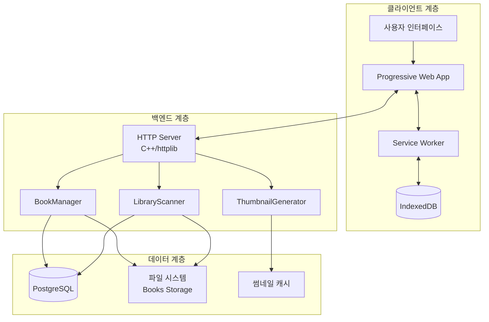
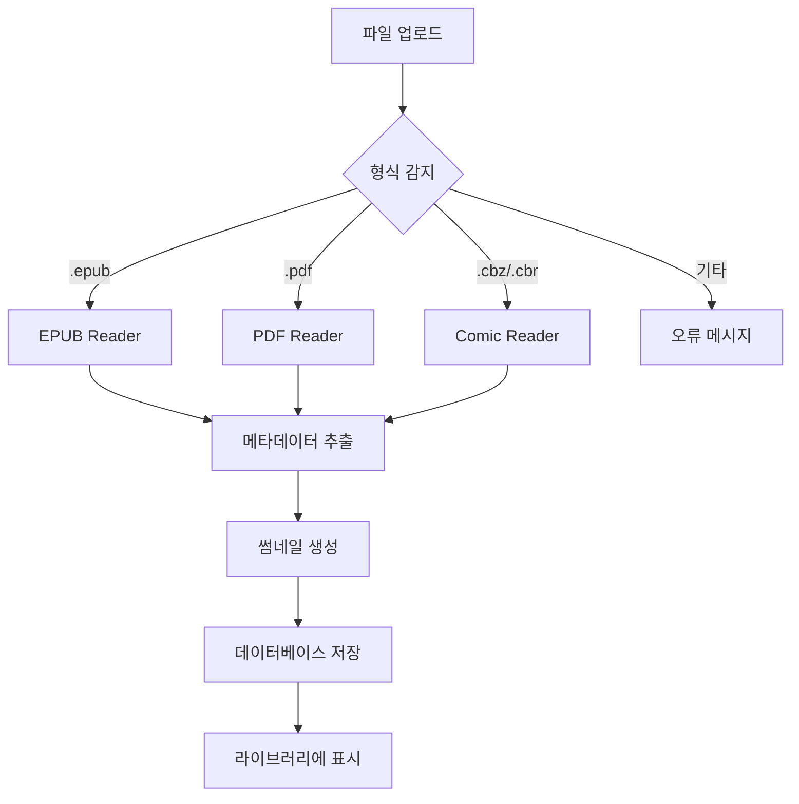

# 📘 MyLibrary 프로젝트 청사진 v2.0

> **작성일**: 2025년 8월 27일  
> **버전**: 2.0  
> **기반**: notes 폴더 문서 종합 분석 및 현재 코드 상황

---

## 🎯 프로젝트 비전

MyLibrary는 **개인 및 소규모 조직을 위한 종합적인 디지털 도서관 솔루션**입니다. 고성능 C++ 백엔드와 모던 PWA 프론트엔드를 통해 다양한 전자책 형식을 지원하며, 오프라인 읽기와 진행률 동기화를 제공하는 자체 호스팅 가능한 시스템입니다.

---

## 🏗️ 시스템 아키텍처

### 전체 시스템 구조


### 기술 스택 현황

#### 백엔드 (C++)
- **웹서버**: httplib (HTTP/HTTPS 지원)
- **데이터베이스**: PostgreSQL + libpqxx
- **JSON 처리**: nlohmann/json
- **파일 처리**: minizip (EPUB), tinyxml2 (메타데이터)
- **인증**: OpenSSL 기반 세션 토큰

#### 프론트엔드 (TypeScript/Vite)
- **모듈 아키텍처**: Vanilla JS + 컴포넌트 시스템
- **라우팅**: 자체 개발 SPA Router
- **상태 관리**: EventBus + BaseComponent
- **오프라인 지원**: Service Worker + IndexedDB
- **리더**: epub.js, pdf.js, JSZip

---

## 📊 현재 상황 분석

### ✅ 완성된 기능들
1. **사용자 인증 시스템** (100%)
   - 로그인/회원가입/로그아웃
   - 세션 토큰 기반 인증
   - API 보안

2. **코드 모듈화** (95%)
   - main.ts 2,097줄 → 73줄로 축소
   - 컴포넌트 기반 아키텍처 도입
   - EventBus 통신 시스템

3. **Admin 시스템** (90%)
   - 라이브러리 스캔 (심볼릭링크 지원)
   - 실시간 모니터링 페이지
   - 고아 레코드 정리

4. **파일 업로드 시스템** (85%)
   - 멀티파트 파일 업로드
   - 메타데이터 자동 추출
   - 썸네일 생성

### 🚧 진행 중인 작업들
1. **썸네일 시스템** (70%)
   - 데이터베이스 쿼리 수정 완료
   - 프론트엔드 로딩 로직 부분 구현
   - PWA 캐싱 미구현

2. **리더 시스템** (60%)
   - 기본 구조 완성
   - EPUB/PDF/Comic 포맷 지원 골격
   - 실제 파일 읽기 기능 미완성

### ❌ 미해결 문제들
1. **라이브러리 스캔 시 도서 추가 안됨**
   - `LibraryScanner: (new book addition should be done via upload API)` 오류
   - 스캔과 업로드 API 간 연동 문제

2. **프론트엔드 디자인 시스템**
   - 컬러 스킴 통일 미완료
   - 미니멀 디자인 적용 미완료
   - 모바일 최적화 부족

---

## 🎨 디자인 철학

### 미니멀리즘 원칙
- **정보 계층**: 핵심 기능 우선, 보조 기능 숨김
- **색상 체계**: 다크 테마 기본, 고대비 텍스트
- **UI 요소**: 사각형 컨테이너, 직선적 레이아웃
- **피드백**: ASCII 점자 스피너, 텍스트 기반 상태

### 사용자 경험 목표
1. **신속한 접근**: 3클릭 이내 모든 기능 접근
2. **직관적 탐색**: 계층적 정보 구조
3. **일관된 인터랙션**: 동일한 동작은 동일한 결과
4. **반응형 디자인**: 모든 기기에서 최적화

---

## 📚 지원 형식 및 기능

### 파일 형식


### 핵심 기능
1. **읽기 기능**
   - 페이지네이션 또는 스크롤
   - 북마크 및 하이라이트
   - 읽기 설정 (폰트, 배경색, 줄간격)
   - 진행률 자동 저장

2. **라이브러리 관리**
   - 자동 메타데이터 추출
   - 태그 및 카테고리 분류
   - 검색 및 필터링
   - 컬렉션 관리

3. **오프라인 지원**
   - PWA 설치 가능
   - 오프라인 도서 저장
   - 진행률 로컬 캐싱
   - 네트워크 복구 시 자동 동기화

---

## 🚀 개발 로드맵

### Phase 1: 핵심 기능 안정화 (2주)
**목표**: 기본 읽기 경험 완성

#### 1.1 스캔 시스템 수정 (3일)
```cpp
// LibraryScanner 개선
class LibraryScanner {
    // 스캔 시 자동 도서 추가 로직
    void process_new_book(const std::string& file_path) {
        auto metadata = extract_metadata(file_path);
        auto thumbnail = generate_thumbnail(file_path);
        database->add_book(metadata, thumbnail);
    }
};
```

#### 1.2 썸네일 시스템 완성 (4일)
- 프론트엔드 점진적 로딩 구현
- PWA 썸네일 캐싱 시스템
- 실시간 상태 업데이트

#### 1.3 리더 기능 구현 (7일)
- EPUB.js 완전 통합
- PDF.js 페이지 렌더링
- Comic 이미지 뷰어
- 진행률 저장/복원

### Phase 2: UX/UI 개선 (2주)
**목표**: 일관된 사용자 경험

#### 2.1 디자인 시스템 통일 (5일)
```css
/* 통일된 컬러 스킴 */
:root {
  --bg-primary: #0a0a0a;
  --bg-secondary: #1a1a1a;
  --bg-tertiary: #2a2a2a;
  --text-primary: #ffffff;
  --text-secondary: #cccccc;
  --accent: #4f46e5;
  --success: #10b981;
  --warning: #f59e0b;
  --error: #ef4444;
}
```

#### 2.2 Admin 페이지 단일화 (4일)
- 모든 관리 기능을 단일 페이지에 통합
- 실시간 모니터링 개선
- 파일 탐색기 구현

#### 2.3 반응형 디자인 (5일)
- 모바일 최적화
- 태블릿 레이아웃
- 터치 인터랙션

### Phase 3: 고급 기능 (3주)
**목표**: 생산성 및 편의성 향상

#### 3.1 컬렉션 시스템 (1주)
```typescript
interface Collection {
  id: string;
  name: string;
  description?: string;
  bookIds: number[];
  visibility: 'public' | 'private';
  sharedWith?: string[];
  createdAt: string;
  updatedAt: string;
}
```

#### 3.2 배치 관리 기능 (1주)
- 다중 파일 선택 및 업로드
- 배치 메타데이터 편집
- 배치 삭제 및 이동

#### 3.3 검색 및 필터링 (1주)
- 전체 텍스트 검색 (PostgreSQL FTS)
- 고급 필터링 (저자, 장르, 연도)
- 저장된 검색 쿼리

### Phase 4: 성능 최적화 (2주)
**목표**: 대용량 라이브러리 지원

#### 4.1 페이지네이션 시스템 (1주)
- 가상 스크롤링 구현
- 지연 로딩 최적화
- 캐싱 전략 개선

#### 4.2 백엔드 최적화 (1주)
- 데이터베이스 인덱싱
- 썸네일 생성 최적화
- 메모리 사용량 최적화

---

## 🔧 기술적 도전 과제

### 1. 대용량 파일 처리
**문제**: PDF 파일이나 고해상도 만화책 처리 시 메모리 부족
**해결 방안**:
- 스트리밍 처리 구현
- 청크 단위 읽기
- 워커 스레드 활용

### 2. 오프라인 동기화
**문제**: 네트워크 불안정 환경에서 데이터 충돌
**해결 방안**:
- Conflict-free Replicated Data Types (CRDT)
- 마지막 수정 시간 기반 병합
- 사용자 선택 기반 충돌 해결

### 3. 보안 강화
**문제**: 파일 업로드 및 사용자 데이터 보안
**해결 방안**:
- 파일 타입 검증 강화
- 업로드 크기 제한
- HTTPS 강제 적용
- CSRF 토큰 구현

---

## 📊 성능 목표

### 응답 시간
- **API 응답**: 95% 요청이 100ms 이내
- **페이지 로딩**: 초기 로딩 2초 이내
- **썸네일 생성**: 파일당 5초 이내

### 확장성
- **동시 사용자**: 100명 지원
- **라이브러리 크기**: 10,000권 지원
- **파일 크기**: 개당 최대 500MB

### 리소스 사용량
- **메모리**: 최대 2GB RAM
- **저장공간**: 썸네일 캐시 최대 1GB
- **CPU**: 스캔 시 80% 이하 유지

---

## 🔮 장기 비전 (6개월 이후)

### 멀티 테넌시
- 조직별 라이브러리 분리
- 권한 기반 접근 제어
- 사용량 모니터링

### AI 기능
- 자동 태그 분류
- 개인화 추천 시스템
- 읽기 패턴 분석

### 통합 기능
- 외부 메타데이터 DB 연동 (OpenLibrary, ISBN)
- 클라우드 스토리지 지원 (S3, GCS)
- LDAP 인증 통합

---

## 📈 성공 지표

### 사용자 경험
- **완독률**: 업로드된 책의 50% 이상 완독
- **재방문율**: 주간 재방문율 70% 이상
- **오류율**: 사용자 액션 실패율 1% 이하

### 시스템 안정성
- **가동시간**: 99.9% 이상
- **데이터 무결성**: 백업/복구 성공률 100%
- **보안**: 중대한 보안 사고 0건

### 개발 생산성
- **코드 품질**: TypeScript 엄격 모드 100% 통과
- **테스트 커버리지**: 80% 이상
- **배포 주기**: 주 1회 안정적 배포

---

이 청사진은 MyLibrary 프로젝트의 **현재 상황을 기반으로 한 실현 가능한 로드맵**입니다. 각 단계별로 구체적인 구현 계획과 성공 지표를 제시하여 체계적인 개발을 지원합니다.