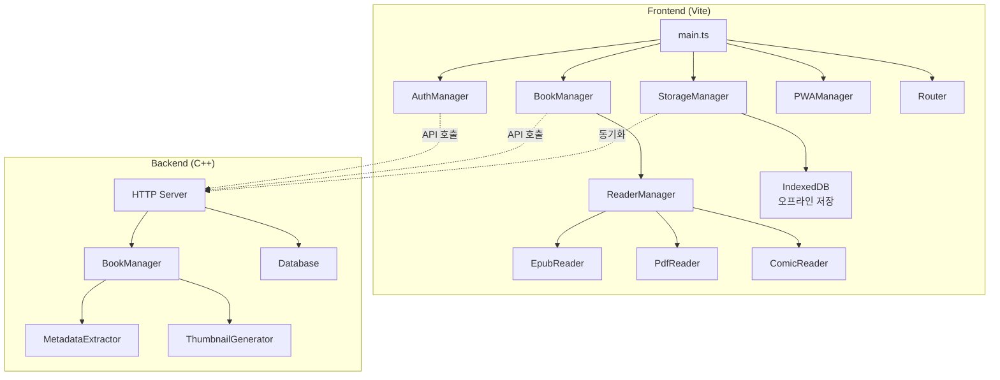
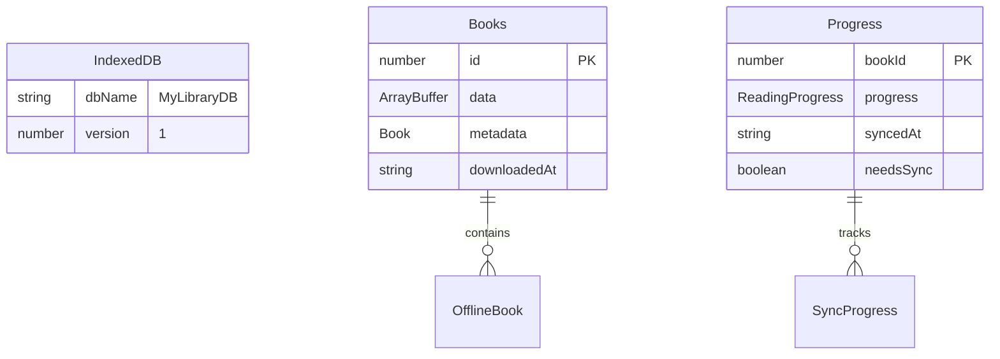
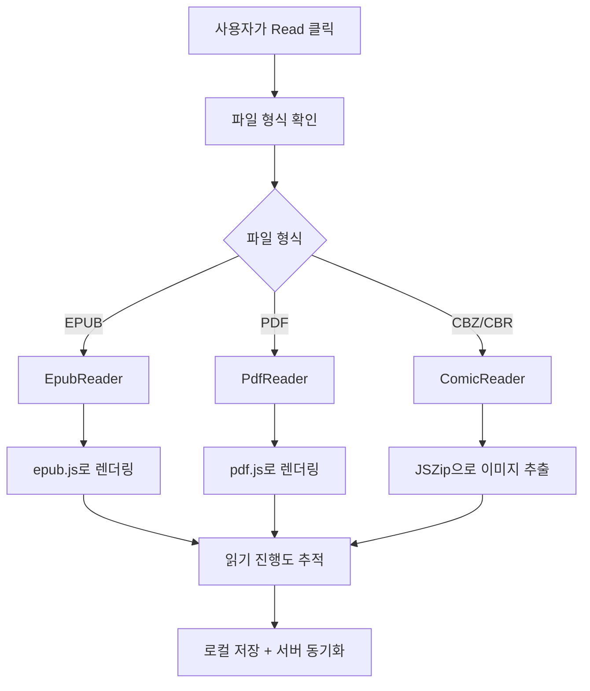
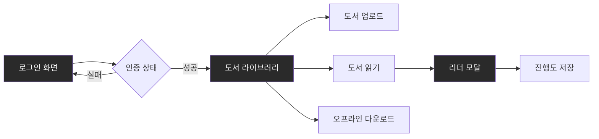
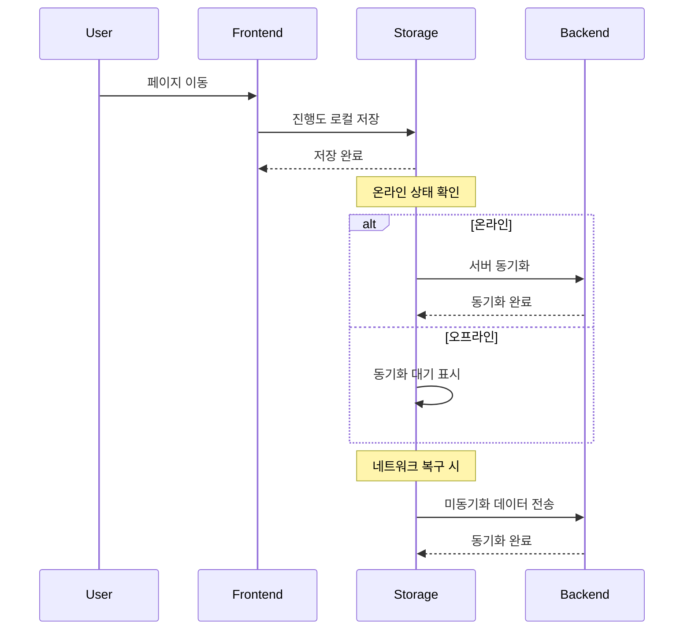
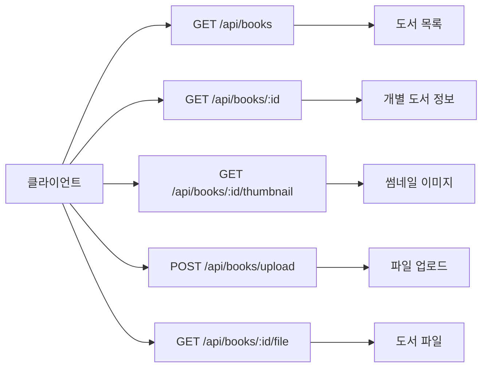

# MyLibrary Frontend-Vite 구현 보고서

*작성일: 2025-08-26*  
*버전: 0.2.0*

## 📋 개요

MyLibrary 프로젝트에서 기존의 Next.js와 Angular 프론트엔드를 대체하여 Vite 기반의 새로운 전자책 뷰어 프론트엔드를 구현했습니다. 이 보고서는 구현 과정과 주요 기능을 상세히 다룹니다.

## 🎯 주요 목표

1. **개별 유저별 각 도서별 접근 권한 관리**
2. **웹 인터페이스를 통한 도서 업로드**
3. **PWA 완벽 지원 + 오프라인 읽기**
4. **읽기 상태 추적 및 동기화**
5. **미니멀한 인터페이스** (ASCII 점자 스피너 등)
6. **EPUB, PDF, 만화책 완벽 지원**

## 🏗️ 시스템 아키텍처



## 🗂️ 프로젝트 구조

```
frontend-vite/
├── src/
│   ├── main.ts              # 메인 애플리케이션
│   ├── style.css            # 미니멀 스타일링
│   └── lib/
│       ├── types.ts         # 타입 정의
│       ├── api.ts           # API 통신
│       ├── auth.ts          # 인증 관리
│       ├── books.ts         # 도서 관리
│       ├── storage.ts       # 로컬 저장소
│       ├── pwa.ts           # PWA 기능
│       ├── router.ts        # 라우팅
│       └── readers/
│           ├── reader-manager.ts
│           ├── epub-reader.ts
│           ├── pdf-reader.ts
│           └── comic-reader.ts
├── public/
│   ├── manifest.json        # PWA 매니페스트
│   └── sw.js               # 서비스 워커
└── index.html
```

## 🔧 주요 구현 내용

### 1. 사용자 인증 시스템

**AuthManager 클래스**
- 로그인/회원가입/로그아웃 기능
- 세션 토큰 관리 (localStorage)
- C++ 서버와의 API 통신

```typescript
// 주요 메서드
async login(username: string, password: string): Promise<void>
async register(username: string, password: string): Promise<void>
async logout(): Promise<void>
async isAuthenticated(): Promise<boolean>
```

### 2. 도서 관리 시스템

**BookManager 클래스**
- 도서 목록 조회
- 도서 업로드
- 오프라인 다운로드
- 리더 실행

```typescript
// 핵심 기능
async getBooks(): Promise<Book[]>
async uploadBook(file: File): Promise<void>
async downloadForOffline(bookId: number): Promise<void>
async openReader(bookId: number, container: HTMLElement): Promise<void>
```

### 3. 오프라인 저장소

**StorageManager 클래스**
- IndexedDB를 활용한 로컬 저장
- 오프라인 도서 저장
- 읽기 진행도 로컬 저장 및 동기화



### 4. 다양한 포맷 지원

**리더 시스템**
- **EPUB Reader**: epub.js 라이브러리 활용
- **PDF Reader**: pdf.js 라이브러리 활용  
- **Comic Reader**: JSZip을 통한 압축 해제



### 5. PWA 기능

**PWAManager 클래스**
- 서비스 워커 등록
- 앱 설치 프롬프트
- 캐싱 전략

```json
// manifest.json 주요 설정
{
  "name": "MyLibrary - Ebook Reader",
  "short_name": "MyLibrary",
  "display": "standalone",
  "start_url": "/",
  "theme_color": "#4f46e5"
}
```

## 🎨 UI/UX 디자인

### 미니멀 디자인 철학
- **다크 테마** 기본 적용
- **ASCII 점자 스피너** 사용
- **반응형 디자인** (모바일 최적화)
- **카드 기반 레이아웃**



### CSS 변수 시스템
```css
:root {
  --bg-primary: #1a1a1a;
  --bg-secondary: #2a2a2a;
  --text-primary: #ffffff;
  --accent: #4f46e5;
  --success: #10b981;
  --error: #ef4444;
}
```

## 🔄 데이터 플로우

### 읽기 진행도 동기화



## 🚀 배포 및 빌드

### 개발 환경
```bash
npm run dev        # 개발 서버 실행 (포트 3000)
```

### 프로덕션 빌드
```bash
npm run build      # 프로덕션 빌드
npm run preview    # 빌드 결과 미리보기
```

## 📊 성능 최적화

### 1. 지연 로딩
- 리더 컴포넌트는 필요시에만 로드
- 책 메타데이터는 점진적 로딩

### 2. 캐싱 전략
- 서비스 워커를 통한 리소스 캐싱
- IndexedDB를 통한 데이터 캐싱

### 3. 번들 최적화
- Vite의 코드 스플리팅 활용
- 트리 셰이킹을 통한 불필요한 코드 제거

## 🔧 서버 개선사항

### 데이터베이스 스키마 확장

```sql
-- books 테이블 확장
ALTER TABLE books ADD COLUMN description TEXT;
ALTER TABLE books ADD COLUMN publisher VARCHAR(255);
ALTER TABLE books ADD COLUMN thumbnail_path VARCHAR(500);
ALTER TABLE books ADD COLUMN metadata_extracted BOOLEAN DEFAULT FALSE;

-- 썸네일 테이블 생성
CREATE TABLE book_thumbnails (
    book_id INTEGER PRIMARY KEY REFERENCES books(id),
    thumbnail_path VARCHAR(500) NOT NULL,
    generated_at TIMESTAMP DEFAULT CURRENT_TIMESTAMP
);
```

### 새로운 API 엔드포인트



### 메타데이터 추출 시스템

**BookManager 개선**
- EPUB 메타데이터 파싱
- PDF 문서 속성 추출
- 만화책 정보 추출
- 썸네일 자동 생성

```cpp
// 핵심 구조체
struct BookMetadata {
    std::string title;
    std::string author;
    std::string description;
    std::string publisher;
    std::vector<unsigned char> cover_image;
    int page_count;
};
```

## 🐛 문제 해결 과정

### 1. 무한 루프 문제
**증상**: 앱 초기화가 무한 반복됨
**원인**: Router와 이벤트 리스너의 충돌
**해결**: 전역 초기화 플래그 도입

```typescript
let appInitialized = false;
function initializeApp() {
  if (appInitialized) return;
  appInitialized = true;
  // 초기화 코드...
}
```

### 2. 타입스크립트 모듈 임포트 오류
**증상**: `doesn't provide an export named` 오류
**원인**: ES 모듈과 CommonJS 혼재
**해결**: `type` import 사용

```typescript
import type { Book, AuthResponse } from './types';
```

### 3. 서버 응답 구조 불일치
**증상**: 로그인 성공해도 인증 실패
**원인**: `result.session_token` vs `result.data.session_token`
**해결**: 유연한 응답 파싱

```typescript
const sessionToken = result.data?.session_token || result.session_token;
```

## 📈 향후 개선 계획

### 단기 목표 (1-2주)
1. **실제 EPUB 파싱** - minizip 라이브러리 활용
2. **이미지 썸네일 생성** - ImageMagick 연동
3. **PDF 메타데이터 추출** - Poppler 라이브러리
4. **실제 리더 UI 구현** - 페이지네이션, 북마크

### 중기 목표 (1개월)
1. **전체 텍스트 검색** - PostgreSQL FTS
2. **컬렉션 기능** - 플레이리스트 형태
3. **공유 기능** - 사용자간 도서 공유
4. **읽기 통계** - 대시보드

### 장기 목표 (3개월)
1. **다국어 지원** - i18n
2. **테마 시스템** - 라이트/다크/커스텀
3. **클라우드 동기화** - 다기기 동기화
4. **AI 추천 시스템** - 개인화된 도서 추천

## 🔍 기술 스택 요약

### Frontend
- **프레임워크**: Vite + TypeScript
- **상태관리**: 클래스 기반 매니저 패턴
- **스토리지**: IndexedDB (idb 라이브러리)
- **리더**: epub.js, pdf.js, JSZip
- **PWA**: Web App Manifest + Service Worker

### Backend  
- **언어**: C++20
- **웹서버**: httplib
- **데이터베이스**: PostgreSQL + libpqxx
- **JSON**: nlohmann/json
- **암호화**: OpenSSL

### 개발도구
- **빌드**: CMake
- **패키지매니저**: npm
- **버전관리**: Git

## 🔄 기존 프론트엔드에서 마이그레이션

### Next.js 프론트엔드 (frontend/)

**주요 특징**
- React 기반의 컴포넌트 구조
- TypeScript 타입 시스템
- 상세한 BookReader 컴포넌트 (설정, 북마크, 줌 기능)
- Tailwind CSS 스타일링

**유용한 기능들**
```typescript
// 기존 ReaderSettings 인터페이스
interface ReaderSettings {
  fontSize: number;
  fontFamily: string;
  lineHeight: number;
  backgroundColor: string;
  textColor: string;
  pageWidth: number;
}

// 고급 리더 기능들
- 폰트 크기/가족 변경
- 줌 및 회전 기능
- 북마크 시스템
- 읽기 설정 커스터마이징
```

**타입 정의 개선점**
```typescript
// 더 상세한 ReadingProgress 타입
interface ReadingProgress {
  page?: number;
  chapter?: number;
  progress_percent: number;
  last_position?: string;
  notes?: string;           // 메모 기능
  total_pages?: number;
  updated_at: string;
}

// 리더 상태 관리
interface ReaderState {
  bookId: number;
  book: Book;
  currentPage: number;
  totalPages: number;
  fontSize: number;
  progress: ReadingProgress;
  isLoading: boolean;
}
```

### Angular 프론트엔드 (frontend-angular/)

**주요 특징**
- SSR (Server-Side Rendering) 지원
- Zone.js 기반 변경 감지
- HTTP 클라이언트 최적화 (withFetch)
- 애니메이션 시스템

**설정 예시**
```typescript
// Angular의 프로바이더 시스템
export const appConfig: ApplicationConfig = {
  providers: [
    provideBrowserGlobalErrorListeners(),
    provideZoneChangeDetection({ eventCoalescing: true }),
    provideRouter(routes),
    provideClientHydration(withEventReplay()),
    provideHttpClient(withFetch()),
    provideAnimationsAsync()
  ]
};
```

### 마이그레이션 비교표

| 기능 | Next.js | Angular | Vite (신규) |
|------|---------|---------|-------------|
| **번들 크기** | 큼 | 매우 큼 | 작음 |
| **개발 속도** | 보통 | 느림 | 빠름 |
| **타입 안정성** | 높음 | 높음 | 높음 |
| **오프라인 지원** | 제한적 | 제한적 | 완전 |
| **PWA 지원** | 부가 설정 | 부가 설정 | 내장 |
| **리더 기능** | 풍부 | 기본 | 기본→확장 예정 |
| **학습 곡선** | 보통 | 높음 | 낮음 |

### 향후 마이그레이션 계획

**1단계: 기본 기능 유지** ✅
- 로그인/회원가입
- 도서 목록/업로드
- 기본 리더 기능

**2단계: 고급 기능 이식** (예정)
```typescript
// Next.js에서 가져올 기능들
interface AdvancedReaderSettings {
  fontSize: number;
  fontFamily: string;
  lineHeight: number;
  backgroundColor: string;
  textColor: string;
  pageWidth: number;
  nightMode: boolean;
  serifFont: boolean;
}

// 북마크 시스템
interface Bookmark {
  id: string;
  bookId: number;
  position: string;
  note?: string;
  created_at: string;
}
```

**3단계: 성능 최적화**
- Angular의 OnPush 변경 감지 전략 적용
- Next.js의 이미지 최적화 기법 도입
- 두 프레임워크의 장점 결합

## 📝 결론

Vite 기반의 새로운 프론트엔드는 기존 Next.js/Angular 대비 다음과 같은 장점을 제공합니다:

1. **빠른 개발 경험** - Vite의 HMR과 빌드 속도
2. **경량화된 번들** - 불필요한 프레임워크 오버헤드 제거
3. **완전한 오프라인 지원** - PWA + IndexedDB
4. **미니멀한 UX** - 전자책 읽기에 집중된 인터페이스
5. **점진적 개선** - 기존 기능을 단계적으로 마이그레이션

기존 프론트엔드의 고급 기능들(리더 설정, 북마크, 메모)은 2단계에서 구현될 예정이며, 서버 측 메타데이터 추출과 썸네일 생성 기능이 완성되면 사용자 경험이 크게 향상될 것으로 기대됩니다.